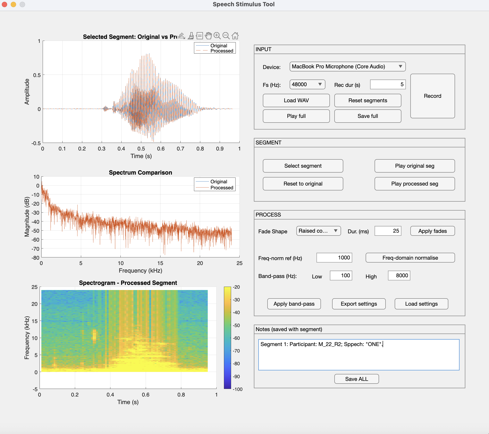

# **Speech Stimulus Tool**

The **Speech Stimulus Tool** is an interactive MATLAB-based GUI for preparing, inspecting, and processing audio segments for behavioural and psychophysical experiments. It provides an integrated workflow for loading/recording speech, selecting time segments, applying acoustic manipulations, and exporting stimuli together with plots and metadata.

Run `speechStimulusTool` from the directory in Matlab.

The interface is split into two functional halves:

## **Left Panel — Visualisation**

### **1. Time Signal**

Displays the full waveform (or the selected segment), with overlays for original vs processed segments.

### **2. Spectrum**

Shows magnitude spectra using FFT (original vs processed), enabling inspection of spectral changes after filtering, fading, or frequency normalisation.

### **3. Spectrogram**

Displays the time-frequency representation of the processed segment using a Hamming window, 30 ms window length, and 20 ms overlap.

## **Right Panel — Control Panels**

### **INPUT Panel**

Provides tools for acquiring or loading audio:

- **Device dropdown** — choose recording audio device.
- **Fs (Hz)** — sampling rate.
- **Rec dur (s)** — recording duration.
- **Load WAV** — load an external .wav file.
- **Record** — start recording with a live countdown.
- **Play full** — playback raw signal.
- **Save full** — export normalised full signal.
- **Reset segments** — clears all selected/processed segments.

------

### SEGMENT Panel

Handles manual extraction of portions of the full signal:

- **Select segment** — click-and-drag rectangle on the waveform to extract a time interval.
- **Reset to original** — remove all processing on the selected segment.
- **Play original seg** — playback unprocessed segment.
- **Play processed seg** — playback processed version.

---

### PROCESS Panel

Applies manipulations to the selected segment:

#### **1. Fades**

Options: *Linear*, *Raised cosine*, *Gaussian*

- Smooths edges using configurable fade-in/out durations.

#### **2. Frequency-domain Normalisation**

Implements envelope-based spectral peak shifting:

- Identify the spectral envelope peak.
- Shift the envelope so that the maximum occurs at the chosen reference frequency.
- Preserve original phase → natural speech quality maintained.
- RMS-matched to avoid loudness differences.

#### **3. Band-pass Filtering**

Butterworth filtering with adjustable low/high cutoff bounds.

#### **4. Settings Export / Import**

Save or load processing configurations as YAML files.

------

### Notes Panel

Allows typing notes for the current stimulus. Notes are saved with the processed WAV and plots.

## **Exporting**

**Save ALL** produces a complete package including:

- Processed segment (_segment.wav)
- Waveform plot
- Spectrum plot
- Spectrogram plot
- YAML configuration file
- Notes file

All outputs are written into a new folder named after the chosen base filename.

## **Advanced Features**

### **Envelope-based Frequency Peak Shifting**

The custom applyFreqNormEnvelope() method:

1. Computes FFT magnitude.
2. Smooths with a Gaussian to estimate spectral envelope.
3. Locates the dominant spectral peak.
4. Shifts the envelope (integer-bin shift) to the target frequency.
5. Applies ratio shaping to magnitudes without altering phase.
6. Reconstructs waveform using inverse FFT.
7. Matches RMS to original segment.

This preserves natural timbre while aligning peak energy across stimuli.

## Requirements

- MATLAB R2020b or newer
- Signal Processing Toolbox (recommended)